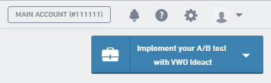
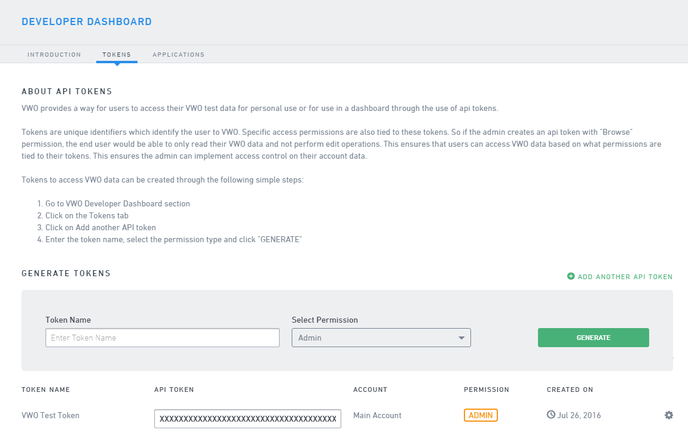
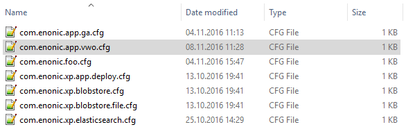
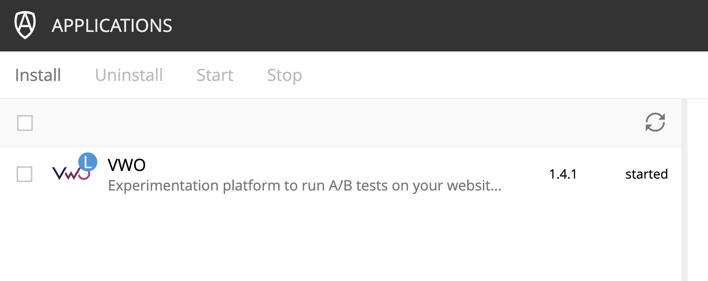
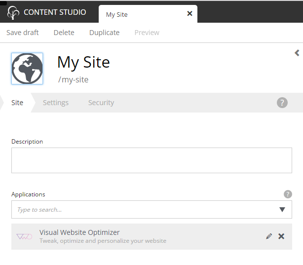
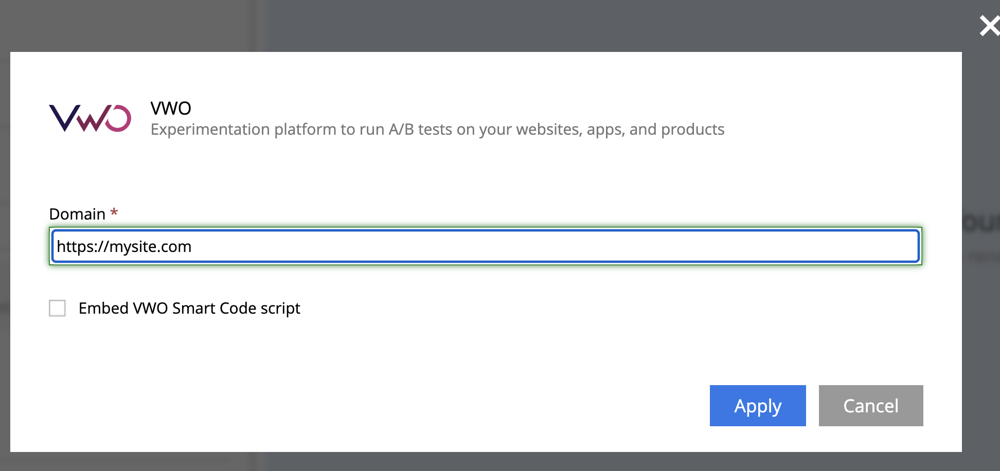
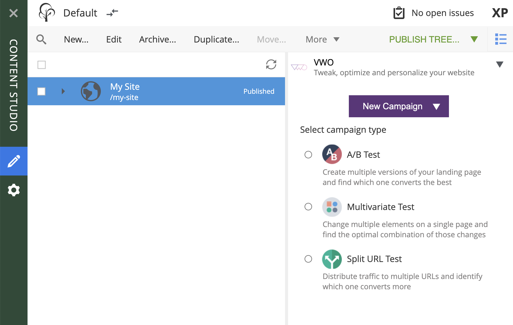

# Installing the app

*This guide assumes that you already have a VWO account. If not, please create one at [VWO site](https://vwo.com/).*

*Before proceeding with installing our XP VWO App, you should have two things:*

* VWO Account ID, which can be found in the top right corner of your VWO dashboard at VWO site.



* API Token, which can be found or generated in the [VWO tokens section](https://app.vwo.com/#/developers/tokens).



* In the config folder of your XP installation (xp_home/config) create a text file called “com.enonic.app.vwo.cfg”.



* In the config file write the following content where \<account-id\> is the VWO Account ID and \<token\> is VWO API Token:
```
    vwo.accountId = <account-id>
    vwo.token = <token>
```

* Now install XP VWO App from Enonic Market via XP Application Manager or [download](https://github.com/enonic/app-vwo.git), build and deploy. The XP VWO App should now appear in the Applications console.



* In the Content Manager of Enonic XP click Edit for a site you’re setting up integration for and select “Visual Website Optimizer” from Site config dropdown.



* In the XP VWO App config section enter domain of your website.
*Ensure, that domain name starts with http:// or https://, otherwise site config will get invalid.*



That’s it, you’re done with integration!
You should now be able to see "VW Optimizer" in the detail panel of your website.

