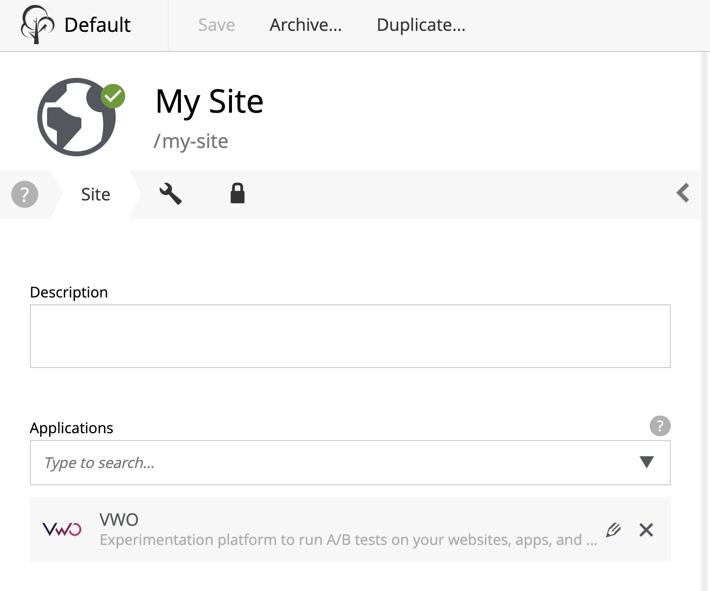

# Installing the app

*This guide assumes that you already have a VWO account with access to API. If not, please contact [VWO](https://vwo.com/) for getting an account and access to their API.*

*Before proceeding with installing our XP VWO App, you should have two things:*

* VWO Account ID, which can be found in the top right corner of your VWO dashboard at VWO site.


* API Token, which can be found or generated in the [VWO tokens section](https://app.vwo.com/#/developers/tokens).


* In the config folder of your XP installation ($XP_HOME/config) create a text file called “com.enonic.app.vwo.cfg”.


* In the config file write the following content where \<account-id\> is the VWO Account ID and \<token\> is VWO API Token:
```
    vwo.accountId = <account-id>
    vwo.token = <token>
```

* Now install VWO App from Enonic Market via Application Manager or [download](https://github.com/enonic/app-vwo.git), build and deploy. VWO App should now appear in the Applications console.


* In Content Studio click Edit for the site you’re setting up integration for and select “VWO” from Site config dropdown.



* In the VWO App config section enter domain of your website.
*Ensure that domain name starts with http:// or https://, otherwise site config will not be valid.*
*Check off "Embed VWO Smart Code script" if you want VWO tracking to be enabled on the pages of your website.*


That’s it, you’re done with integration!
You should now be able to see "VW Optimizer" in the detail panel of your website.


